# Voice AI Patient Registration

A phone agent that registers new U.S. patients by natural conversation, saves them to PostgreSQL, and exposes the records through a REST API and a live dashboard.

| | |
|---|---|
| **Phone number** | `+1 (737) 637-8556`  |
| **API base URL** | `https://voice-patient-registration-production-ed38.up.railway.app` |
| **Dashboard** | `https://voice-patient-registration-production-ed38.up.railway.app/dashboard` |
| **Interactive API docs** | `https://voice-patient-registration-production-ed38.up.railway.app/docs` |
| **Credentials** | None needed. Read and write endpoints are open for review (see _Security_). |

** It's set up and waiting on billing.
---

## Architecture

```mermaid
flowchart LR
    Caller((Caller)) -- PSTN --> Vapi
    subgraph Vapi["Vapi (managed voice platform)"]
      direction TB
      STT["Deepgram nova-3<br/>speech-to-text"] --> LLM["GPT-4.1<br/>system prompt + tools"] --> TTS["Azure neural voice<br/>text-to-speech"]
    end
    Vapi -- "tool-calls / end-of-call-report<br/>(HTTPS webhook, X-Vapi-Secret)" --> Webhook
    subgraph API["FastAPI service (Railway)"]
      direction TB
      Webhook["voice/webhook.py<br/>voice/handlers.py"] --> Services
      REST["api/patients.py<br/>REST endpoints"] --> Services
      Dashboard["/dashboard<br/>static HTML"] -- fetch --> REST
      Services["services/*<br/>one write path"] --> Validators["validators.py<br/>shared field rules"]
    end
    Services --> DB[(PostgreSQL)]
```



**Separation of concerns**

| Layer | Where | Responsibility |
|---|---|---|
| Telephony, STT, TTS, turn-taking | Vapi | Phone number, audio, barge-in, calls our tools |
| Conversation | `app/voice/prompts.py`, `assistant_config.py` | Prompt, tool schemas, voice/transcriber settings. Versioned in git and pushed to Vapi by a script |
| Voice ↔ backend boundary | `app/voice/webhook.py`, `handlers.py` | Parses Vapi events, runs tools, never raises (errors become speakable results) |
| Business logic | `app/services/` | The only code that writes patients, calls, appointments |
| Validation | `app/validators.py` | One set of field rules used by **both** the REST API and the voice tools |
| HTTP API | `app/api/` | Thin routes, `{data, error}` envelope, status codes |
| Data | `app/models.py` | SQLAlchemy models with DB-level constraints |

The voice agent calls the **service layer directly** (same process), not the REST API over HTTP. The challenge allows either; this skips a network hop inside a live call, avoids a second auth path, and still guarantees one write path and one set of rules.

### A registration call, step by step

1. Vapi answers and speaks the first message. The LLM collects fields conversationally.
2. After each group of answers (name + DOB, phone, address, optional details) the LLM calls **`validate_fields`**. The server normalizes the values ("Texas" → `TX`, "512.555.0199" → `5125550199`) and returns per-field errors, which the agent uses to re-ask **only** the bad field. Valid values are also saved to `call_logs.collected_data`, so a dropped call leaves partial data behind.
3. If the phone number matches an existing patient, `validate_fields` returns `existing_patient` and the agent asks whether to update that record instead.
4. The agent reads everything back in two short chunks and handles corrections.
5. Only after a clear "yes" it calls **`save_patient`** with `caller_confirmed: true`. The server re-validates everything, blocks duplicates, writes, and returns `saved` (or `invalid` / `duplicate_found` / `error`, each with a `next_step` hint).
6. The agent says "You're all set, Jane!", offers a first appointment (bonus), then ends the call.
7. Vapi posts an **`end-of-call-report`**. The transcript and AI summary are stored and linked to the patient, and calls that ended before saving are marked `incomplete`.

---

## Tech stack and why

| Choice | Why |
|---|---|
| **Vapi** | Handles telephony, STT, TTS, barge-in and tool-calling, and gives a free U.S. number. Time goes into the prompt and backend instead of audio plumbing, which the challenge recommends. |
| **GPT-4.1 via Vapi** (fallback GPT-4o) | Reliable tool-calling and instruction-following at low latency; no separate OpenAI key needed. Temperature 0.3 keeps formats consistent. |
| **Deepgram nova-3, `language: multi`** | Accurate on names, digits and addresses, and handles English/Spanish switching. |
| **Azure `en-US-AvaMultilingualNeural`** | Natural voice that also speaks Spanish with the same persona. Falls back to Vapi's `Elliot` automatically. |
| **Python + FastAPI** | Fast to build, typed, automatic OpenAPI docs at `/docs`, good test client. |
| **SQLAlchemy 2 + PostgreSQL** | Real constraints (CHECK, enum, UUID, timestamptz), and it survives restarts. The same models run on SQLite for zero-setup local dev and tests. |
| **Railway** | Git-push deploys, managed Postgres, TLS domain, health checks. No ngrok tunnel to die during review. |
| **Vanilla HTML dashboard** | No build step; served by the API itself. |

---

## Data model

`patients` has the 19 required fields plus `deleted_at` for soft delete.

| Field | Type | Rule (enforced in `validators.py`, and in the DB where noted) |
|---|---|---|
| `patient_id` | UUID PK | auto |
| `first_name`, `last_name` | varchar(50) NOT NULL | 1–50 letters, hyphens, apostrophes (and inner spaces, e.g. "De La Cruz"). **DB:** length CHECK |
| `date_of_birth` | date NOT NULL | real date, not in the future, ≥ 1900. Accepts MM/DD/YYYY or ISO, returned as MM/DD/YYYY. **DB:** ≥ 1900 CHECK |
| `sex` | varchar(20) NOT NULL | Male / Female / Other / Decline to Answer (aliases like "prefer not to say" map). **DB:** enum CHECK |
| `phone_number` | varchar(10) NOT NULL | 10 digits, area code can't start with 0/1; "+1 (512) 555-0199" normalizes. **DB:** regex CHECK (Postgres) |
| `email` | varchar(254) | valid format, lower-cased |
| `address_line_1` / `address_line_2` | varchar(200) / varchar(100) | required / optional |
| `city` | varchar(100) NOT NULL | 1–100 chars |
| `state` | varchar(2) NOT NULL | valid USPS code (50 states + DC + territories); full names map. **DB:** regex CHECK |
| `zip_code` | varchar(10) NOT NULL | `12345` or `12345-6789` (9 digits are formatted). **DB:** regex CHECK |
| `insurance_provider`, `insurance_member_id` | varchar | optional; member ID uppercase alphanumeric |
| `preferred_language` | varchar(50) NOT NULL | default `English` |
| `emergency_contact_name`, `emergency_contact_phone` | varchar | optional; phone rules as above |
| `created_at`, `updated_at`, `deleted_at` | timestamptz | UTC, auto |

Indexes: `lower(last_name)`, `date_of_birth`, `phone_number` (the three search filters and duplicate detection).

Supporting tables: **`call_logs`** (Vapi call id, caller number, status, outcome, partial `collected_data` JSON, transcript, summary, ended reason) and **`appointments`** (bonus; `UNIQUE(slot_id)` prevents double booking).

Demo seed data: Jane Doe (512-555-0147) and Carlos Rivera (305-555-0182). Both are fictional 555-01xx numbers. They're inserted only into an empty database (`SEED_DEMO_DATA=false` disables it).

---

## REST API

Every response uses the same envelope: `{"data": ..., "error": null}` or `{"data": null, "error": {"code", "message", "details"?}}`.

| Method | Endpoint | Success | Errors |
|---|---|---|---|
| GET | `/patients?last_name=&date_of_birth=&phone_number=&limit=&offset=` | 200 list | 422 bad filter |
| GET | `/patients/{id}` | 200 | 404, 422 bad UUID |
| POST | `/patients` | **201** created record | 400 malformed JSON, 422 field errors |
| PUT | `/patients/{id}` | 200 (partial update) | 400 empty body, 404, 422 |
| DELETE | `/patients/{id}` | 200 `{patient_id, deleted_at}` (soft delete) | 404 |
| GET | `/patients/{id}/calls` | 200 transcripts for that patient | 404 |
| GET | `/patients/{id}/appointments` | 200 | 404 |
| GET | `/calls?status=incomplete` | 200 recent calls | 422 |
| GET | `/health` | 200 (checks DB) | 503 |
| GET | `/vapi/status` | 200 voice agent setup state + phone number | |
| POST | `/vapi/webhook` | Vapi events | 401 bad secret |

```bash
BASE=https://YOUR-APP.up.railway.app

curl -s -X POST $BASE/patients -H 'Content-Type: application/json' -d '{
  "first_name": "Jane", "last_name": "Doe", "date_of_birth": "03/15/1988", "sex": "Female",
  "phone_number": "(512) 555-0199", "address_line_1": "742 Evergreen Terrace",
  "city": "Austin", "state": "TX", "zip_code": "78701"
}'

curl -s "$BASE/patients?last_name=doe&date_of_birth=03/15/1988"
curl -s -X PUT $BASE/patients/<id> -H 'Content-Type: application/json' -d '{"address_line_2": "Apt 4"}'
curl -s -X DELETE $BASE/patients/<id>

# Validation example → 422 with per-field details
curl -s -X POST $BASE/patients -H 'Content-Type: application/json' \
  -d '{"first_name":"J0hn","last_name":"Doe","date_of_birth":"01/01/2999","sex":"x","phone_number":"123","address_line_1":"1 Main","city":"Austin","state":"ZZ","zip_code":"1"}'
```

Server-side validation doesn't depend on the voice agent. The API rejects unknown fields (so clients can't set `patient_id` or `created_at`), strips control characters, collapses whitespace, and uses parameterized SQL through the ORM. The dashboard HTML-escapes all output.

---

## Voice agent design

The full system prompt, with design notes, is in [`app/voice/prompts.py`](app/voice/prompts.py). The tool definitions and voice settings are in [`app/voice/assistant_config.py`](app/voice/assistant_config.py).

**Prompt engineering decisions**

- **Written for the ear.** Short turns, at most two questions at once, no lists or markdown. Dates are said naturally, phone numbers in 3-3-4 groups, ZIP codes digit by digit.
- **The model runs the conversation; the server enforces the rules.** The LLM never decides whether a date is valid; it calls `validate_fields`. That removes a whole class of hallucinated "that looks fine" answers, and the voice and API rules can't drift apart.
- **Guardrails live in code, not only in the prompt.** `save_patient` refuses without `caller_confirmed: true`, refuses a phone-number duplicate unless `allow_duplicate` (e.g. a family member sharing a phone), and is idempotent per call: a correction after saving updates the same record.
- **Phone number early.** Duplicate detection fires before the caller spends a minute on an address we already have.
- **Two-chunk read-back.** Reading 16 fields in one breath isn't usable on a phone.
- **Spell-back only when ambiguous.** For names like Davis/Davies, Jon/John, or uncommon names, so common names don't slow the call.
- **`next_step` in every tool result.** Keeps the model on track after errors without scripting its exact words.
- **Turn-taking tuned for dictation.** `waitSeconds 0.6`, `onNumberSeconds 1.2` and `onNoPunctuationSeconds 1.5` give callers time to finish digit strings. `stopSpeakingPlan.numWords 2` means a quick "mm-hmm" doesn't cut the agent off, but a real interruption does.
- **Returning callers verify their date of birth** (`verify_existing_patient`) before the agent reads back or changes their record.

**Tools:** `validate_fields`, `save_patient`, `verify_existing_patient`, `update_patient`, `get_available_appointments`, `book_appointment`, and Vapi's built-in `endCall`.

### Edge cases and resilience

| Scenario | Behavior |
|---|---|
| Invalid DOB ("January 1st 2090") or 9-digit phone | `validate_fields` returns a field-specific reason; agent re-asks only that field ("That date would be in the future…") |
| Correction ("it's D-A-V-I-S, not Davies") | Prompt: replace, re-validate, confirm just that change. After saving, a re-save in the same call updates the same record |
| Out-of-order answers ("I'm Jane Doe, born 3/15/88, I live in Austin") | Prompt: capture everything given, don't re-ask |
| Interruptions | Vapi barge-in (`stopSpeakingPlan`) + prompt: stop and respond |
| "Can we start over?" | Prompt: acknowledge, discard collected values, restart from the name |
| Caller hangs up / line drops mid-call | Validated fields are already in `call_logs.collected_data`; the end-of-call report marks the call `incomplete`. It shows on the dashboard's Calls tab for follow-up, and no half-finished patient row is written |
| Database write fails | One automatic retry on connection errors. Then the tool returns `status: error` and the agent apologizes, says nothing was saved, and offers to retry. The confirmed payload is written to the log (`patient.save_failed … payload=`) for recovery. The caller never hears silence |
| Our server slow/unreachable | Vapi speaks `request-response-delayed` / `request-failed` messages configured on each write tool |
| Returning caller, same phone | "It looks like we already have a record for Jane Doe. Would you like to update your information instead?" → DOB check → partial update |
| Family member sharing a phone | Caller says it's a different person → `allow_duplicate: true` |
| Spanish caller ("Hablo español") | Switches language; `preferred_language` becomes Spanish; tool formats stay canonical |
| Medical question / emergency | Doesn't give advice; tells the caller to hang up and call 911 in an emergency |

### Observability

Logs go to stdout (Railway's log viewer):

- `tool.request` / `tool.call`: every tool call with arguments, result status and latency
- `patient.final_payload`: the final saved record for every registration or update
- `call.ended`: status, outcome, ended reason and partial data for every call
- `patient.save_failed`: dead-letter line with the confirmed payload if the DB write fails

Transcripts and AI summaries are stored in `call_logs`, linked to the patient, and shown on the dashboard (bonus: call transcript).

---

## Running locally

```bash
python -m venv .venv && source .venv/bin/activate
pip install -r requirements-dev.txt
uvicorn app.main:app --reload          # SQLite by default → http://localhost:8000/dashboard
pytest -q                               # 44 tests: validators, API, simulated Vapi call flows, provisioning
```

With PostgreSQL: `docker compose up --build`, or set `DATABASE_URL=postgresql://…`. Run the tests against Postgres with `TEST_DATABASE_URL=postgresql://… pytest -q`. (Tested on both SQLite and PostgreSQL.)

To talk to a local server from a real phone, expose it (`ngrok http 8000`), set `PUBLIC_BASE_URL` to the tunnel URL, and run the Vapi setup below.

## Deploying (Railway + Vapi)

1. **Railway** → New Project → *Deploy from GitHub repo* (the `Dockerfile` and `railway.json` are picked up). Add a **PostgreSQL** database to the project.
2. API service → **Settings → Networking → Generate Domain**. `PUBLIC_BASE_URL` is detected from `RAILWAY_PUBLIC_DOMAIN`.
3. API service → **Variables**: `DATABASE_URL` = `${{Postgres.DATABASE_URL}}` and `VAPI_API_KEY` = your Vapi **private** key.
4. That's it. On every boot the service pushes the assistant config from code to Vapi and attaches a free U.S. number, in a background thread and idempotently. Progress and the number are shown at `GET /vapi/status`, on `GET /` and in the dashboard header. New numbers can take a few minutes to activate.

The webhook secret is derived from `VAPI_API_KEY` unless `VAPI_WEBHOOK_SECRET` is set, so it never appears in code or needs manual copying. Manual alternatives: `python -m scripts.setup_vapi --area-code 512` (preview with `--dry-run`), or `POST /admin/vapi/sync` with `X-Admin-Token` when `ADMIN_TOKEN` is set. If Vapi rejects part of the config (for example a voice or model not available on the account), the provisioner retries with simpler fallbacks and reports which variant was applied.

## Environment variables

| Variable | Required | Purpose |
|---|---|---|
| `DATABASE_URL` | prod | Postgres URL (`postgres://` and `postgresql://` both work). Defaults to local SQLite |
| `VAPI_API_KEY` | for the phone agent | Vapi private key. Enables auto-setup of the assistant + number on boot |
| `VAPI_WEBHOOK_SECRET` | optional | Shared secret checked on `X-Vapi-Secret`; derived from `VAPI_API_KEY` when unset |
| `PUBLIC_BASE_URL` | provisioning | Public HTTPS URL; auto from `RAILWAY_PUBLIC_DOMAIN` on Railway |
| `ADMIN_TOKEN` | optional | Enables `POST /admin/vapi/sync` (404 when unset) |
| `VAPI_AUTO_SETUP` | optional | Default `true`; set `false` to skip provisioning on boot |
| `VAPI_PHONE_NUMBER` | optional | Overrides the number shown on the dashboard and `GET /` |
| `API_KEY` | optional | If set, POST/PUT/DELETE require `X-API-Key` |
| `CLINIC_NAME`, `CLINIC_TIMEZONE` | optional | Persona and the timezone used for "today" and appointment slots |
| `SEED_DEMO_DATA`, `LOG_LEVEL` | optional | Defaults `true`, `INFO` |
| `VAPI_MODEL`, `VAPI_VOICE_PROVIDER`, `VAPI_VOICE_ID` | optional | Override model or voice |

No secrets are in the source code.

---

## Known limitations and trade-offs

- **Security.** The API is open by default so reviewers can test without credentials. `API_KEY` protects writes, but real PHI would need proper auth (OAuth/JWT), per-user audit trails, encryption at rest, a BAA with every vendor, and less PHI in logs. The challenge explicitly excludes HIPAA.
- **Duplicate detection discloses the name** on the file for a phone number, as the challenge specifies. Changes and full read-back require a date-of-birth match, but a production system should verify identity before confirming the name exists.
- **No migrations.** Tables are created with `create_all` at startup. Alembic is the next step before any schema change.
- **Name rule allows inner spaces** ("De La Cruz", "Mary Ann") beyond the strict "alphabetic + hyphens/apostrophes" spec, because real names need it.
- **Phone validation** checks 10 digits and a valid area-code first digit, not full NANP exchange rules, so testers can use 555 numbers.
- **Email by voice is error-prone**; the agent spells it back, and it's optional.
- **Start over** is handled in the prompt (conversation state lives in the LLM context). Stale partial data from before a restart can remain in `collected_data` until it's overwritten.
- **Appointments are mock data**: generated slots, three fictional providers, no cancellation flow.
- **Single region, single instance**, with no queue for failed writes beyond the dead-letter log line.
- **Vapi dependency.** An outage takes down the phone channel; the API and dashboard keep working.

## Next steps

1. Alembic migrations; move `create_all` out of startup.
2. Auth on the API and dashboard (JWT/OAuth), audit log table, and PHI redaction in logs.
3. Outbox or retry queue for failed saves instead of a log line.
4. Automated conversation tests with Vapi simulations or chat-mode tests covering corrections, start-over and Spanish.
5. SMS confirmation after registration; appointment reminders.
6. Address verification (USPS/Smarty) and insurance eligibility checks.
7. Per-field confidence: ask for spelling when STT confidence is low.

## Project layout

```
app/
  main.py              app factory, error envelope, /health, /dashboard, admin sync
  config.py            env settings
  database.py          engine/session, naming conventions, startup retry
  models.py            Patient, CallLog, Appointment (+ constraints, indexes)
  validators.py        shared field rules + normalization
  schemas.py           Pydantic create/update schemas, serializers
  seed.py              demo patients
  api/                 REST routes + response envelope
  services/            patients, calls, appointments (single write path)
  voice/
    prompts.py         system prompt + design notes
    assistant_config.py  Vapi assistant: model, voice, STT, tools
    handlers.py        tool implementations
    webhook.py         Vapi event endpoint
    provisioning.py    idempotent assistant + phone number setup
    autosetup.py       runs provisioning in the background on boot
  static/dashboard.html
scripts/setup_vapi.py  CLI provisioning (--dry-run to print config)
tests/                 validators, API, simulated call flows, Vapi provisioning (mocked)
```
